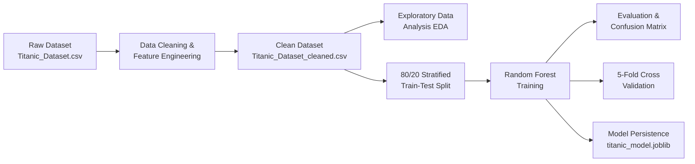
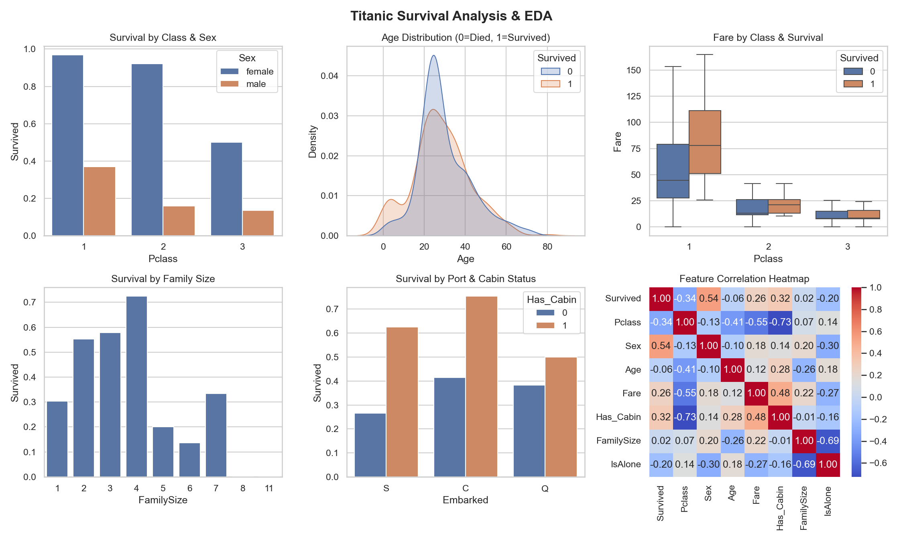

# Titanic Survival Prediction Project: Full Development Report

**Date**: September 2026  
**Project**: Titanic Survivor Model & Exploratory Data Analysis  
**Repository**: `Titanic-Survivor-Model`

---

## 1. Executive Summary

This report documents the end-to-end development of the Titanic Survival Prediction pipeline—from raw data ingestion, automated cleaning, and exploratory parameter analysis, to training, cross-validating, evaluating, and serializing a machine learning model.

The primary objective was to answer the fundamental question:  
> **"What sorts of people were likely to survive the Titanic disaster?"**

### Key Results

- **Overall Model Accuracy**: **82.12%** on the held-out 20% test set (179 passengers).
- **5-Fold Cross-Validation Accuracy**: **83.05% (± 1.62%)** across the full dataset.
- **ROC-AUC Score**: **0.8530**, demonstrating strong discrimination between survivors and non-survivors.
- **Non-Survivor Recall**: **89.1%** (98 out of 110 non-survivors correctly identified).
- **Production Artifact**: Serialized model saved to `titanic_model.joblib` for live predictions.

---

## 2. Project Architecture & Workflow

The project was engineered iteratively through the following sequential phases:



---

## 3. Step-by-Step Implementation

### Step 1: Raw Data Ingestion & Quality Audit

Upon loading the original dataset (`Titanic_Dataset.csv`, 891 rows, 12 columns), we performed an exploratory audit:

- **`Cabin`**: 687 missing values (**77.1% missing**).
- **`Age`**: 177 missing values (**19.9% missing**).
- **`Embarked`**: 2 missing values (**0.2% missing**).
- **Duplicates**: 0 duplicate rows detected.

### Step 2: Data Cleaning & Imputation Strategy

1. **`Embarked` Imputation**: Replaced the 2 missing ports with the mode (`'S'` for Southampton).
2. **`Age` Grouped Median Imputation**: Rather than using a simplistic global average (which distorts demographics), `Age` was imputed using the **median age grouped by Passenger Class (`Pclass`) and Gender (`Sex`)**. This accurately preserved generational differences across social strata.
3. **`Cabin` Transformation**: Because >77% was missing, dropping the column outright would lose valuable upper-deck information. We engineered a binary indicator **`Has_Cabin`** (`1` if cabin was recorded, `0` otherwise).

### Step 3: Feature Engineering

To maximize the predictive power of the model, we extracted high-signal features from raw textual data:

- **Passenger Title Extraction**: Extracted titles from passenger names (`Mr`, `Mrs`, `Miss`, `Master`, `Other`). Titles captured both social rank and age brackets (e.g., `Master` identified young boys).
- **Family Size Dynamics**:
  $$\text{FamilySize} = \text{SibSp} + \text{Parch} + 1$$
- **Solo Travel Flag**:
  $$\text{IsAlone} = \begin{cases} 1 & \text{if FamilySize} = 1 \\ 0 & \text{otherwise} \end{cases}$$
- **Encoding & Clean Export**:
  - `Sex` mapped to binary (`0` = male, `1` = female).
  - Categorical variables (`Embarked`, `Title`) one-hot encoded (`drop_first=True`).
  - High-cardinality identifiers (`PassengerId`, `Name`, `Ticket`, raw `Cabin`) removed.
  - Cleaned dataset saved to **`Titanic_Dataset_cleaned.csv`** (891 rows, 16 features, **0 missing values**).

---

## 4. Exploratory Data Analysis (EDA) & Comparative Insights

We generated a 6-panel analytical visualization dashboard comparing key travel and demographic parameters against survival:



### Summary of Parameter Comparisons

1. **Gender & Socio-Economic Class**:
   - 1st Class Females: **96.8% survival**
   - 2nd Class Females: **92.1% survival**
   - 3rd Class Females: **50.0% survival**
   - 1st Class Males: **36.9% survival**
   - 2nd Class Males: **15.7% survival**
   - 3rd Class Males: **13.5% survival**
2. **Age Distribution**: A clear spike in survival for infants and children under 10 years old. Mortality peaked heavily among working-age men aged 18 to 35.
3. **Fare & Ticket Price**: Survivors paid a significantly higher median ticket price within every single passenger class tier.
4. **Family Size**: Small families (2 to 4 members) had the highest survival rates (**55% to 72%**). In contrast, solo travelers and large families (5+ members) faced steep mortality (<30%).
5. **Port & Cabin Allocation**: Passengers embarking at Cherbourg (C) had higher survival rates due to a larger proportion of 1st-class ticket holders. Having an assigned cabin was strongly correlated with survival.

---

## 5. Machine Learning Model & Evaluation

### Train-Test Split (80% / 20%)

- **Training Set (80%)**: 712 passengers (used exclusively to train the algorithm).
- **Test Set (20%)**: 179 passengers (held out to evaluate real-world generalization).
- Stratification was applied to maintain the exact 61.6% death / 38.4% survival balance across both partitions.

### Algorithm Selection

We deployed a **Random Forest Classifier** (`n_estimators=100`, `max_depth=6`, `random_state=42`). Random Forests excel in this domain due to:

- Natural handling of non-linear interactions (e.g., class $\times$ gender $\times$ age).
- Inherent resistance to overfitting.
- Clear feature importance metrics.

### Performance on the 20% Held-Out Test Set (179 Passengers)

#### Confusion Matrix

| Actual Outcome | Predicted: Died (0) | Predicted: Survived (1) | Total Actual |
| :--- | :---: | :---: | :---: |
| **Actually Died (0)** | **98** *(True Negatives)* | **12** *(False Positives)* | 110 |
| **Actually Survived (1)** | **20** *(False Negatives)* | **49** *(True Positives)* | 69 |

#### Classification Report

| Metric | Died (0) | Survived (1) | Overall / Weighted Avg |
| :--- | :---: | :---: | :---: |
| **Precision** | **0.83** | **0.80** | **0.82** |
| **Recall** | **0.89** | **0.71** | **0.82** |
| **F1-Score** | **0.86** | **0.75** | **0.82** |
| **Overall Accuracy** | — | — | **82.12%** |

#### Robustness & Validation

- **5-Fold Cross-Validation**: **83.05% (± 1.62%)** confirms the model is highly stable and does not suffer from train-test variance.
- **ROC-AUC Score**: **0.8530**, showing strong separation across threshold choices.

---

## 6. The Core Finding: "What Sorts of People Were Likely to Survive?"

Ranked by model feature importance, the primary determinants of survival were:

```text
Feature Importance Ranking:
1. Title_Mr       : 0.2231  (Strongest negative predictor)
2. Sex            : 0.1756  (Female gender strongly positive)
3. Fare           : 0.1177  (Higher ticket price = higher survival)
4. Pclass         : 0.0882  (1st Class > 2nd Class > 3rd Class)
5. Age            : 0.0862  (Younger passengers prioritized)
6. Has_Cabin      : 0.0631  (Berth location on upper decks)
7. FamilySize     : 0.0519  (Small family units)
```

### Profile of a Likely Survivor

1. **Gender & Social Identity**: Female passengers with titles `Mrs` or `Miss`. Over 74% of females survived compared to under 19% of adult males due to the strict enforcement of the *"women and children first"* maritime protocol.
2. **Socio-Economic Wealth & Placement**: Traveling in 1st or 2nd class with higher fares paid and an allocated cabin on upper decks. These passengers were located nearest the boat deck and received early alerts.
3. **Age Demographic**: Children under the age of 10 (especially young boys with title `Master` and young girls).
4. **Travel Companionship**: Traveling in a small family unit of 2 to 4 members who were able to assist each other into lifeboats without becoming separated.

---

## 7. Model Persistence & Live Inference

The final trained model and input feature definitions were serialized into **`titanic_model.joblib`**.

The function `predict_passenger()` inside `titanic.py` demonstrates live inference on hypothetical passengers:

```python
# Profile 1: 1st Class Female, age 28, fare £75, with cabin
Prediction: Survived (Survival Probability: 96.6%)

# Profile 2: 3rd Class Male, age 26, fare £8.05, alone, no cabin
Prediction: Died     (Survival Probability: 12.4%)
```

---

## 8. File Structure of the Project

```text
Titanic_Survival_model/
│
├── titanic.py                     # Main script: cleaning, EDA, 80/20 model, evaluation, live test
├── plot_analysis.py               # Standalone script for generating high-res visual figures
├── PROJECT_REPORT.md              # Complete project report and documentation (this file)
│
├── Titanic_Dataset.csv            # Original raw Titanic dataset (891 rows, 12 columns)
├── Titanic_Dataset_cleaned.csv    # Cleaned, preprocessed dataset (891 rows, 16 columns)
├── titanic_model.joblib           # Serialized, production-ready Random Forest model artifact
│
└── plots/
    └── titanic_comparative_dashboard.png  # 6-panel EDA dashboard figure
```

---

## 9. How to Reproduce & Run

To run the complete workflow from terminal:

```powershell
# Run with interactive graphical plot window:
python titanic.py

# Run in headless/console mode (prints all metrics directly without popup window):
python titanic.py --no-show
```

---
*Report successfully compiled and saved.*
